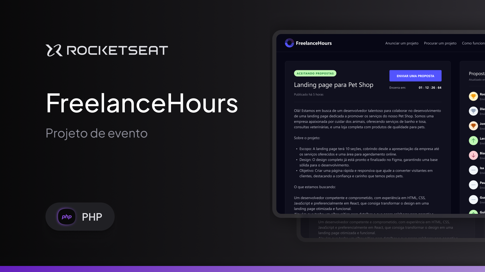

</a>

## Sobre o Projeto

Uma landing page que simulando uma plataforma para desktop onde freelancers enviam propostas de horas, que eles podem
contribuir nos projetos apresentados.  

É um projeto criado exclusivamente para o curso gratuíto de PHP da Rocketseat.  

Foram utilizados:

- [PHP](https://www.php.net/) como linguagem de programação.
- [Laravel](https://laravel.com/) como framework para a estrutura e organização do projeto.
- [Herd](https://herd.laravel.com) como ambiente de desenvolvimento Laravel e PHP.
- [LiveWire](https://laravel-livewire.com/) como criador de interfaces dinâmicas e reativas.
- [Tailwind](https://tailwindcss.com/) como framework CSS.
- [SQLite](https://www.sqlite.org/) como banco de dados.
- [Dbdiagram.io](https://dbdiagram.io/home) como ferramenta para desenhar digramas ER para banco de dados.

## About Project

A landing page that simulates a desktop platform where freelancers submit proposals for hours that they can
contribute to the projects presented.  

It's a project created exclusively for Rocketseat's free PHP course.  

Were used:

- [PHP](https://www.php.net/) as a programming language.
- [Laravel](https://laravel.com/) as a framework for project structure and organization.
- [Herd](https://herd.laravel.com) as Laravel and PHP development environment.
- [LiveWire](https://laravel-livewire.com/) as a creator of dynamic and reactive interfaces.
- [Tailwind](https://tailwindcss.com/) as a CSS framework.
- [SQLite](https://www.sqlite.org/) as a databases.
- [Dbdiagram.io](https://dbdiagram.io/home) as a tool for designing ER diagrams for databases.

### Sobre el Proyecto

Una landing page que simula una plataforma para desktop en que los autónomos presentan propuestas de horas que pueden
aportar a los proyectos presentados.  

Es un proyecto creado exclusivamente para el curso gratuito de PHP de Rocketseat.  

Se han utilizado:

- [PHP](https://www.php.net/) como lenguaje de programación.
- [Laravel](https://laravel.com/) como framework para la estructura y organización del proyecto.
- [Herd](https://herd.laravel.com) como entorno de desarrollo Laravel y PHP.
- [LiveWire](https://laravel-livewire.com/) como creador de interfaces dinámicas y reactivas.
- [Tailwind](https://tailwindcss.com/) como framework CSS.
- [SQLite](https://www.sqlite.org/) como base de datos.
- [Dbdiagram.io](https://dbdiagram.io/home) como herramienta de diseño de digramas ER para bases de datos.
 
 

Fernando 🎉😁:)

